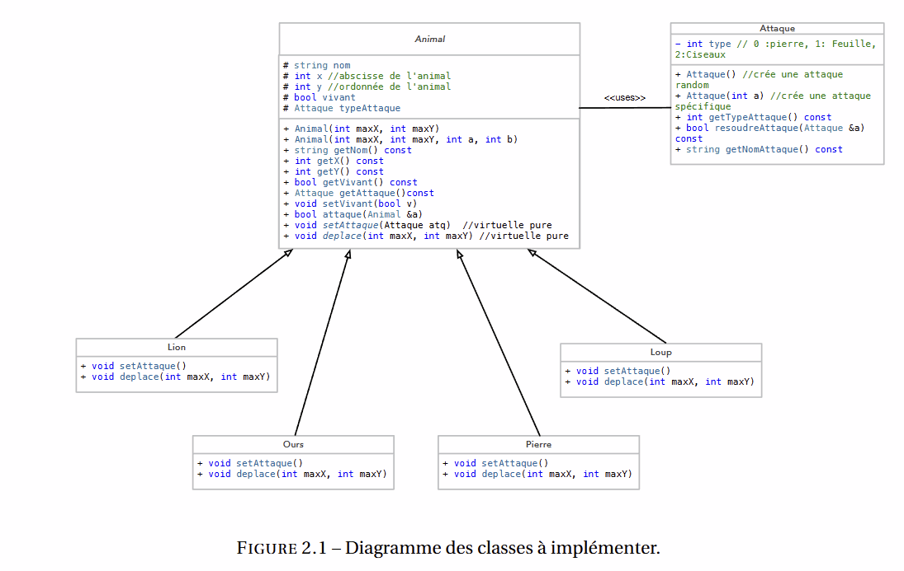

#### ECOLE CENTRALE DE NANTES

# RAPPORT SMP - TP8
## Simulation de Vie Artificielle

**Date:** Mars 2026
**Auteurs:** Nabil Khouani - Jonas Maouche

---

## Introduction

L'objectif de ce TP est de développer les bases d’un mini-jeu de vie artificielle en utilisant les concepts de la programmation orientée objet en C++, notamment le polymorphisme et l'héritage. Le jeu simule des combats entre différents types d'animaux sur un plateau de jeu.

---

## 1. Architecture et Conception

Le programme est structuré autour d'une classe de base abstraite `Animal` et de plusieurs classes dérivées représentant des types spécifiques d'animaux. Une classe `Attaque` gère la logique des combats.

### Diagramme de Classes



### Classe `Attaque`
Cette classe modélise le système de combat de type "pierre-feuille-ciseaux".
*   **Attributs :**
    *   `type` : un entier représentant l'arme (0: Pierre, 1: Feuille, 2: Ciseaux).
*   **Méthodes :**
    *   `Attaque()`: Constructeur qui choisit une attaque au hasard.
    *   `Attaque(int)`: Constructeur qui choisit une attaque spécifique.
    *   `resoudreAttaque(Attaque &a)`: Compare deux attaques et renvoie `true` si l'instance courante gagne. En cas d'égalité, le résultat est aléatoire.
    *   `getNomAttaque()`: Retourne le nom de l'attaque sous forme de chaîne de caractères.

### Classe `Animal` (Abstraite)
C'est la classe de base pour toutes les créatures du jeu.
*   **Attributs :**
    *   `nom`, `x`, `y`, `vivant`, `typeAttaque`.
*   **Méthodes Virtuelles Pures :**
    *   `setAttaque()`: Méthode abstraite qui doit être implémentée par chaque classe fille pour définir sa stratégie d'attaque.
    *   `deplace(int maxX, int maxY)`: Méthode abstraite qui gère le mouvement de l'animal sur le plateau torique.
*   **Autres Méthodes :**
    *   `attaque(Animal &a)`: Gère le déroulement d'un combat entre deux animaux, de la définition des attaques à la désignation du perdant.

### Classes Concrètes d'Animaux

Chaque classe hérite d'`Animal` et implémente son propre comportement pour `setAttaque` et `deplace`.

*   **`Pierre`**:
    *   **Déplacement**: Ne se déplace pas.
    *   **Attaque**: Utilise toujours "Pierre".

*   **`Loup`**:
    *   **Déplacement**: Se téléporte aléatoirement sur n'importe quelle case du plateau.
    *   **Attaque**: Utilise l'une des trois attaques (Pierre, Feuille, Ciseaux) au hasard.

*   **`Lion`**:
    *   **Déplacement**: Se déplace en diagonale d'une case.
    *   **Attaque**: Utilise "Feuille" ou "Ciseaux" au hasard.

*   **`Ours`**:
    *   **Déplacement**: Se déplace en "L", comme le cavalier aux échecs.
    *   **Attaque**: Utilise toujours "Feuille".

---

## 2. Logique du Jeu

Le `main.cpp` orchestre la simulation.

### Initialisation
1.  Un plateau de jeu de dimensions 10x10 est défini.
2.  Le plateau est peuplé avec 25% de sa capacité, soit 25 animaux, répartis équitablement entre les types (Loups, Pierres, Lions, Ours).
3.  Le générateur de nombres aléatoires est initialisé.

### Boucle Principale
Le jeu se déroule en tours, tant que l'utilisateur souhaite continuer et qu'il y a plus d'un survivant.
À chaque tour :
1.  **Déplacement**: Chaque animal vivant est déplacé conformément à ses règles via la méthode `deplace()`.
2.  **Résolution des Conflits**: Le plateau est parcouru pour trouver les cases occupées par plusieurs animaux. Sur ces cases, des combats sont simulés jusqu'à ce qu'il ne reste qu'un seul survivant par case. Deux combattants sont choisis au hasard sur la case pour s'affronter.
3.  **Affichage**: L'état du plateau est affiché dans la console, avec des lettres représentant chaque type d'animal.

---

## 3. Compilation et Exécution

### Compilation
Le projet inclut un `Makefile`. Pour compiler, exécutez simplement la commande :
```sh
make
```
Cela générera un exécutable nommé `jeu`.

### Exécution
Pour lancer la simulation, exécutez la commande :
```sh
./jeu
```

---

## 4. Exemple d'Exécution

Voici un aperçu du déroulement d'un tour de jeu.

```text
=== JEU DE VIE ARTIFICIELLE ===
Plateau initial avec 25 animaux
Animaux vivants : 25

  0 1 2 3 4 5 6 7 8 9 
0 . O . . . . . . . P 
1 . . W . . . . L . . 
2 W . . . . P . . . . 
3 . . . L . . . . . . 
4 . . . . W O . . P . 
5 . W . . . . . . . . 
6 . . P . L . W . . O 
7 . . . . . P . . . L 
8 O . . W . . L . . . 
9 . P O . . . . . . . 


--- Tour 1 ---
  Combat! Loup(2,0) avec Feuille VS Ours(4,5) avec Feuille -> Loup a perdu et meurt!
Animaux vivants : 24

  0 1 2 3 4 5 6 7 8 9 
0 . . . . . . . . . . 
1 . . . . . . . L P . 
2 . . . . . P . . . . 
3 . . . L . . . . . . 
4 . . . . W O . . P . 
5 W . . . . . . . . O 
6 . . P . . . W . . . 
7 . . . . . . . . . L 
8 O . . W . L . . . . 
9 . P O . . . . . . . 


Continuer? (o/n) : o
```
